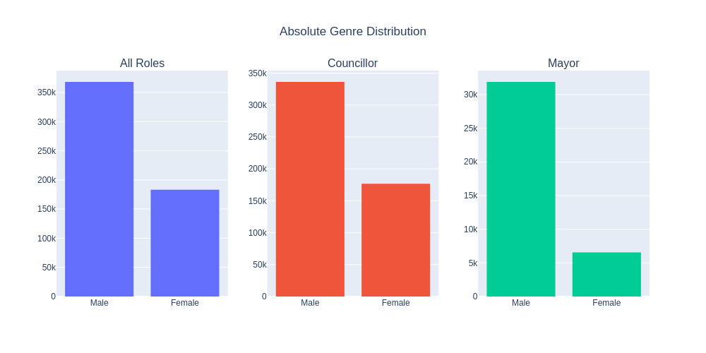
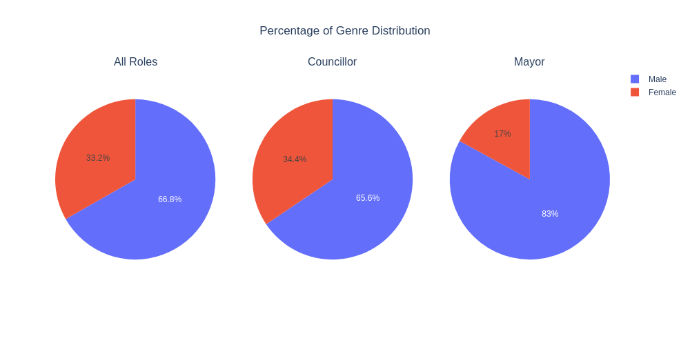
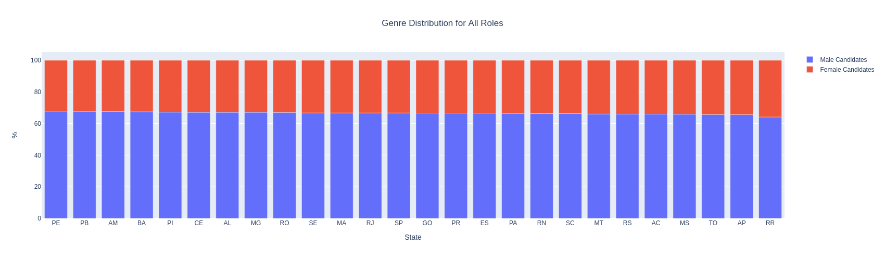
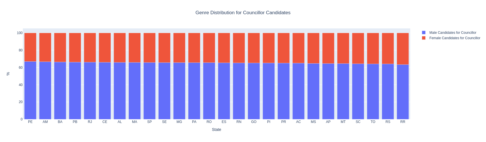
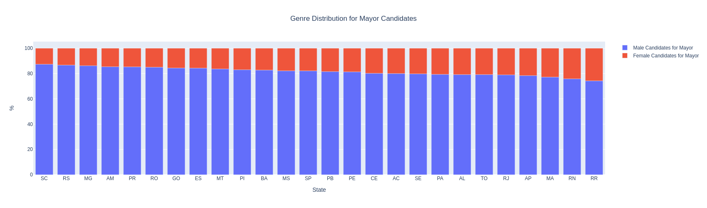
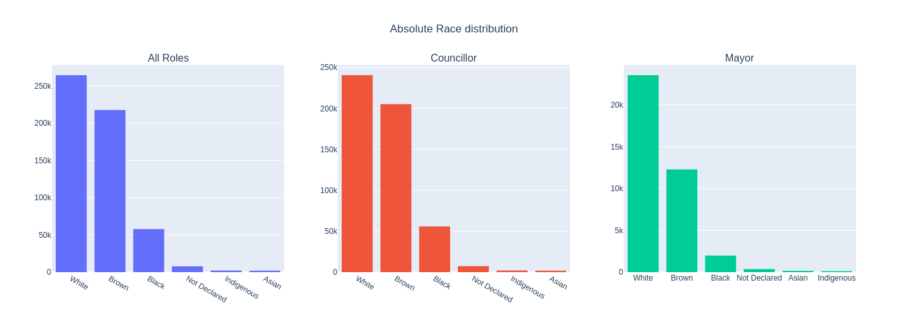
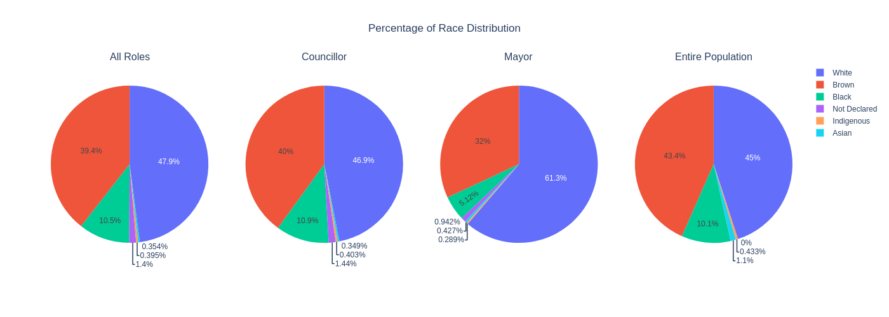
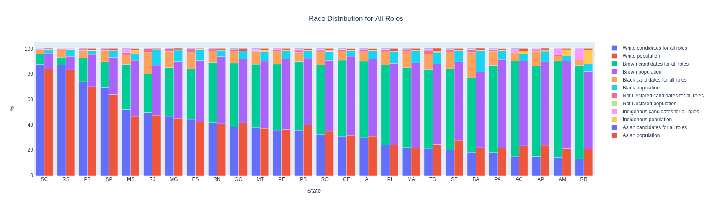
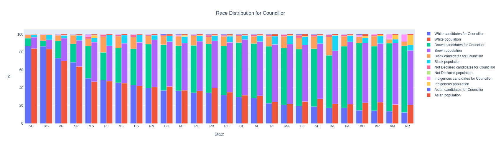
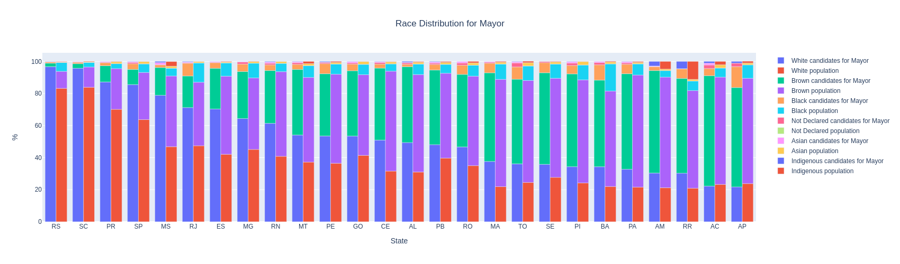

# 2020 Elections in Brazil: An Analysis of Candidate Distribution

### This is a simple EDA (Exploratory Data Analysis) on candidates for the 2020 election in Brazil, which elects Mayors and City Councillors. At the time of this work, the elections haven't taken place yet. We will be looking at gender and race distribution among candidates of both roles. For details on the code used, please check this [jupyter notebook](https://github.com/Pedrohgv/EDA_2020_Brazilian_Elections/blob/main/EDA_2020_Brazilian_Elections.ipynb). Candidate data used for this analysis can be found [here](https://www.tse.jus.br/eleicoes/estatisticas/repositorio-de-dados-eleitorais-1/repositorio-de-dados-eleitorais), and the racial distribution data for Brazil [here](https://en.wikipedia.org/wiki/Race_and_ethnicity_in_Brazil).

## Gender distribution
First, let's take a look at gender distribution for candidates for these roles. A perfect distribution (a distribution that represents the population in general) would, of course, be a 50-50 split between males and females.
The charts below demonstrate gender distribution for candidates of all roles, as well as for each role separately, in both absolute and relative terms.

The plots above demonstrate gender disparity in political representation in candidates across Brazil; despite composing 50% of the population, women constitute only 33.2% of the total number of candidates and are thus under-represented in the candidate pool. This disparity is even bigger in the distribution of candidates for Mayor (a more important role, with women contributing only with 17% for that role). Now, we will take a closer look by analyzing each state with respect to their profile on gender representation.

The plots above show that gender disparity among states, when considering candidates for all roles, doesn't seem to diverge much from each other, being close to that observed in a national view; however, when looking at the distribution of candidates for Mayor, we can see that some states have greater asymmetries between male and female candidates than others. In the state of Santa Catarina for instance, male candidates for Mayor compose more than 87% of the total number of candidates.

## Race Distribution

Next, we will analyze the racial distribution among candidates. In order to do that, we must acquire the data on the race distribution for the Brazilian population. This data is the official data collected from IBGE (Brazilian Institute of Geography and Statistics) and can be found [here](https://en.wikipedia.org/wiki/Race_and_ethnicity_in_Brazil). Below are the charts demonstrating the racial distribution among candidates for all roles and for each role separately in both absolute and relative terms, as well as a specific chart showing the proportional distribution for the entire population.

As can be seen above, the racial distribution for all candidates doesn't seem to diverge much from that of the population. But this is not true when looking at candidates for mayor: 61.3% of them are white, while only 45% of the entire population being self-declared as white. Browns, on the other hand, represent only 32% of the candidate pool for this role while composing 43.4% of the population. Blacks are also under-represented, being only 5.12% of the total candidates for Mayor while forming roughly double that proportion (10.1%) of the population.

Now, we will take this analysis further and visualize the racial distribution in each state separately.

Again, the charts above show a behavior similar to that of the national scene when considering candidates for any role, with whites being sometimes even slightly under-represented in some states (while being slightly over-represented in others). This changes, however, when we look at Mayor candidates, with whites being considerably over-represented in all states and the only exceptions being the states of Acre and Amapá.

## Conclusions

When looking at gender distribution, we can see a clear disparity between males and females in the candidate pool for both roles; however, this disparity is considerably greater for candidates of Mayor positions. On the other hand, racial distribution of candidates for Councillor roles seems to follow the national composition, while the same cannot be said about the pool of candidates for Mayor, with a clear over-representation of whites being observed. It could be interesting to revisit this work once the elections have taken place to analyze and compare its results with the analysis of the candidate pool.
